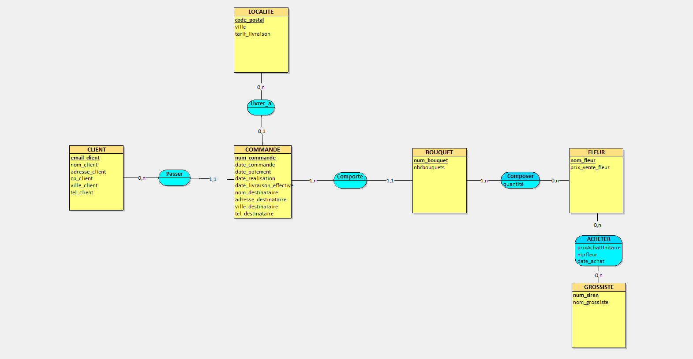

# SAE S1.04 - Conception et création d'une base de données

> Concevoir, depuis un cahier des charges, la base de données Oracle du
> magasin de fleurs « Jardin de Charlotte » : du modèle conceptuel jusqu'aux
> requêtes d'exploitation.

**BUT Informatique, semestre 1 - compétence C4 « Gérer des données de
l'information »**
Walid Ferchach · Amdjed Loucif - janvier 2026

## Le cahier des charges en bref

Une fleuriste lyonnaise vend des bouquets sur commande. Le client décrit la
composition de chaque bouquet qu'il veut (4 roses, 3 tulipes…), le nombre
d'exemplaires souhaité, et choisit entre un retrait en magasin et une
livraison chez un destinataire qui n'est pas forcément lui. Le montant
dépend du prix de vente des fleurs et du tarif de livraison de la commune.
Une commande non réglée reste en attente et n'est jamais livrée.

Chaque matin, la fleuriste achète chez des grossistes les fleurs nécessaires
aux commandes du jour, et relève leur prix d'achat pour suivre ses coûts -
alors que son prix de vente, lui, ne bouge pas.

Le sujet complet : [`docs/sujet-sae-s1.04.pdf`](docs/sujet-sae-s1.04.pdf).

## Le modèle conceptuel



Six entités et quatre associations. Trois choix de modélisation méritent une
explication.

**Les coordonnées de livraison sont portées par `COMMANDE`, pas par
`CLIENT`.** Le destinataire change d'une commande à l'autre : un bouquet
offert, une livraison au bureau. C'est aussi ce qui impose une commande par
point de livraison, comme le demande le sujet.

**`BOUQUET` est une entité faible, identifiée relativement à `COMMANDE`.**
Les bouquets sont numérotés *au sein* de la commande : le bouquet 1 de la
commande 12 n'a rien à voir avec le bouquet 1 de la commande 13. D'où une clé
composée `(numCommande, numBouquet)`, qui se propage à `COMPOSITION`.

**`ACHETER` porte la date dans sa clé.** Le même grossiste revend la même
fleur d'un jour à l'autre, à un prix différent - c'est précisément ce que la
fleuriste veut suivre. La clé est donc `(numSIREN, nomFleur, dateAchat)`.

Trois valeurs `NULL` sont porteuses de sens dans `COMMANDE` :

| Colonne à `NULL` | Signification |
|---|---|
| `datePaiement` | commande en attente de règlement, donc non livrable |
| `dateLivraisonEffective` | commande pas encore soldée |
| `codePostalLivraison` | retrait en magasin, donc aucun frais de livraison |

Les contraintes d'intégrité que le MCD ne sait pas exprimer sont reportées
en `CHECK` dans le schéma : positivité des prix et des quantités, et
cohérence chronologique des quatre dates d'une commande.

## Contenu

```
docs/     sujet, rapport rendu (PDF) et export du MCD
modele/   modèle Looping éditable (.loo)
sql/      scripts de création, d'import et d'exploitation
data/     les 6 CSV du binôme + leur dictionnaire
```

## Reproduire la base

Sous Oracle (SQL Developer), sur un schéma vide :

| # | Script | Rôle |
|---|---|---|
| 1 | [`sql/01_schema.sql`](sql/01_schema.sql) | les 8 tables, leurs contraintes et leurs index |
| 2 | [`sql/03_import_donnees.sql`](sql/03_import_donnees.sql) | charge les 500 commandes de `data/` |
| 3 | [`sql/04_requetes.sql`](sql/04_requetes.sql) | les requêtes R1 à R9 |

L'étape 2 se déroule en deux temps : le script crée d'abord les tables de
travail `TMP_*`, puis on y importe les CSV avec l'assistant de SQL Developer
(*clic droit sur la table → Importer des données…*, séparateur `;`, UTF-8,
dates en `JJ/MM/AAAA`) avant de lancer la suite, qui éclate ces tables vers
le schéma final. Le détour est nécessaire : aucun CSV n'est au format des
tables cibles - voir [`data/README.md`](data/README.md).

[`sql/02_jeu_exemple.sql`](sql/02_jeu_exemple.sql) répond à la question 5 du
sujet (la commande de Mme Juliette) et s'exécute **à la place** de
l'étape 2, sur une base vide : les deux jeux de données se disputeraient les
mêmes numéros de commande. [`sql/00_drop.sql`](sql/00_drop.sql) permet de
repartir de zéro entre deux essais.

## Les requêtes d'exploitation

Résultats obtenus sur le jeu de données du binôme, et vérifiés :

| | Question | Résultat |
|---|---|---|
| R1 | Nombre de commandes payées en 2021 | 127 |
| R2 | Les 3 codes postaux les plus livrés | 69230 Saint-Genis-Laval (27), 69680 Chassieu (24), 69006 Lyon 6ᵉ (21) |
| R3 | La fleur la plus utilisée en 2021 | le Tournesol, 438 fleurs |
| R4 | Nombre moyen de bouquets par client | 17,8 |
| R5 | Les fleurs jamais utilisées | Iris, Magnolia, Marguerite, Pensée |
| R6 | La fleur préférée de chaque client | 131 lignes pour 125 clients |
| R7 | Montant de chaque commande | les 500 commandes |
| R8 | Commande la plus chère en retrait magasin | Boutique Esprit Bohème, 535,00 € |
| R9 | Commande la plus chère, tous modes | Moreau, 640,00 € livrés à Lyon 8ᵉ |

Deux points reviennent dans presque toutes ces requêtes.

**Une fleur compte autant de fois qu'il y a d'exemplaires du bouquet qui la
contient**, d'où le produit `quantite * nbrBouquets` partout où l'on totalise
des fleurs ou un montant. Oublier `nbrBouquets` sous-estime silencieusement
le résultat.

**Les frais de livraison exigent une jointure externe.** Un retrait en
magasin n'a pas de code postal ; un `JOIN` classique sur `LOCALITE` ferait
disparaître ces 134 commandes du résultat. D'où le `LEFT JOIN` et le
`NVL(l.tarifLivraison, 0)` de R7 et R9.

R4 et R6 comportent chacune une part d'interprétation, tranchée en commentaire
dans le script : moyenne *par client* et non par ligne de commande pour R4,
et `RANK()` plutôt que `ROW_NUMBER()` pour R6, afin de ne pas départager
arbitrairement deux fleurs à égalité.

## Rapport

Le document rendu, qui reprend le MCD, le dictionnaire des données, les
commandes de création et les captures d'écran des résultats :
[`docs/rapport-sae-s1.04.pdf`](docs/rapport-sae-s1.04.pdf).
