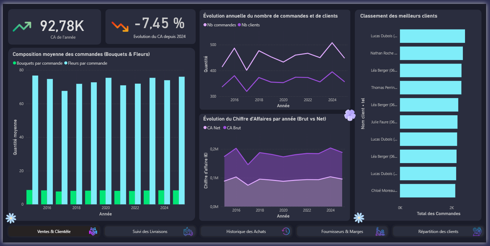
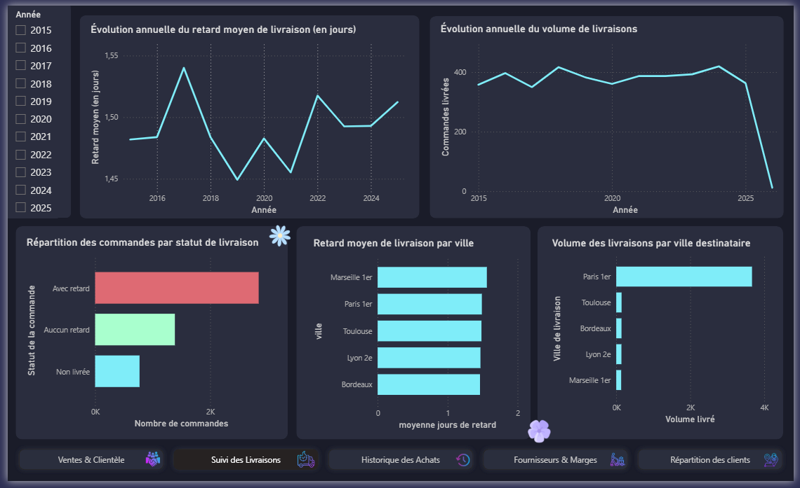
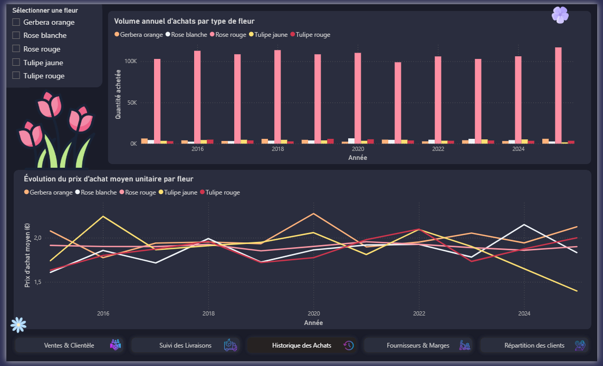
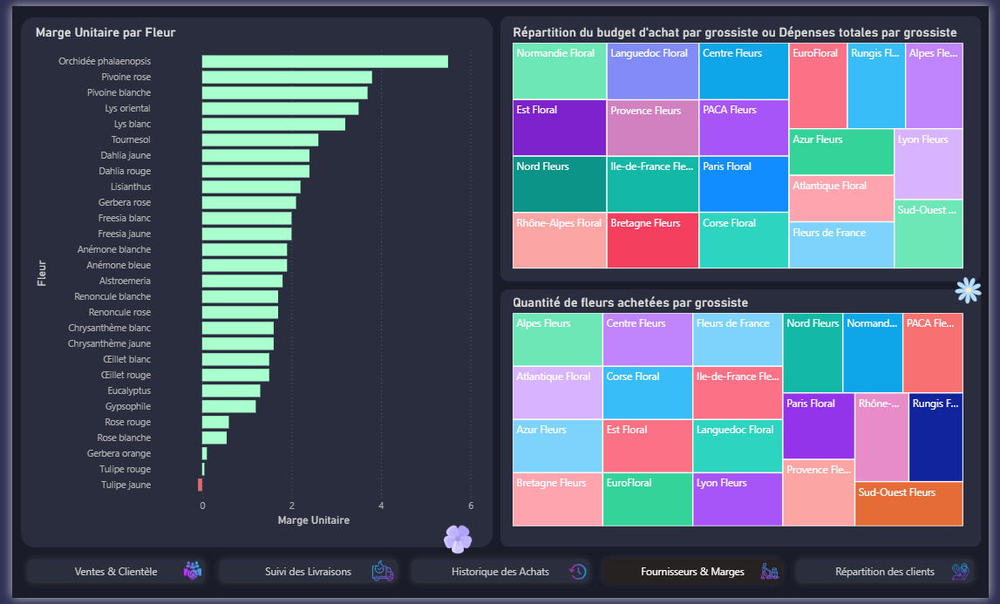
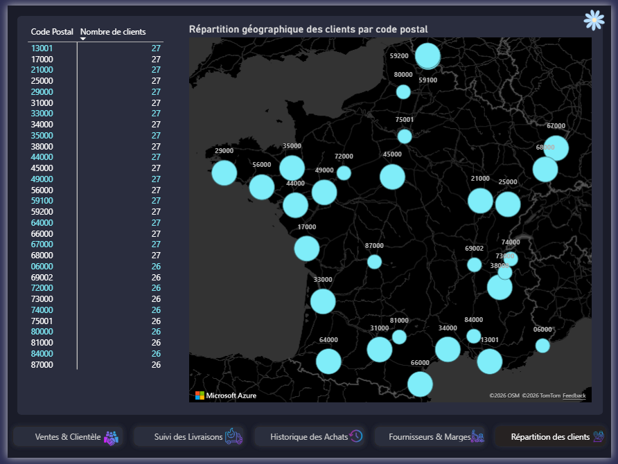

# SAE S2.04 - Tableau de bord Power BI

> Donner aux dirigeants du « Jardin de Charlotte » des visuels qui les aident
> à décider : où sont les ventes, où sont les retards de livraison, et
> combien coûtent réellement les fleurs.

**BUT Informatique, semestre 2 - ressource R2.06 Bases de données**
Walid Ferchach · Raphaël Ghisquière - groupe G3S2A, mars 2026

Suite de la [SAE S1.04](../sae-s1.04-base-de-donnees), sur la même activité
fictive. Le scénario du sujet reprend celui du semestre 1 - une fleuriste
lyonnaise - mais la base Oracle fournie est d'une autre nature : 5 000
commandes et 800 clients répartis sur une trentaine de villes de toute la
France, de 2015 à 2025, approvisionnés par 20 grossistes régionaux
(Rungis Fleurs, Normandie Floral, PACA Fleurs…). Le catalogue compte 28
fleurs, de la rose rouge à l'orchidée phalaenopsis.

Le sujet complet : [`docs/sujet-sae-s2.04.pdf`](docs/sujet-sae-s2.04.pdf).

## Le fichier

[`jardin-de-charlotte.pbix`](jardin-de-charlotte.pbix) - à ouvrir avec Power
BI Desktop. Le modèle est en mode *import* : les données sont embarquées
dans le fichier, qui s'ouvre donc sans accès à la base Oracle. Il ne faut
une connexion que pour rafraîchir les données.

## Le modèle

Huit tables importées depuis Oracle via le connecteur « Base de données
Oracle », puis mises en relation :

| Table | Rôle |
|---|---|
| `SAE_CLIENT` | clients, avec leur code postal |
| `SAE_VILLE` | communes et tarif de livraison |
| `SAE_COMMANDEBOUQUET` | commandes, dates et montant |
| `SAE_BOUQUET` | bouquets d'une commande |
| `SAE_COMPOSITION` | fleurs d'un bouquet |
| `SAE_FLEUR` | catalogue et prix de vente |
| `SAE_GROSSISTE` | fournisseurs |
| `SAE_ACHATFLEUR` | relevés d'achats quotidiens |

Les mesures et colonnes calculées ajoutées par-dessus :

| Mesure | Ce qu'elle calcule |
|---|---|
| `CA Total` | chiffre d'affaires brut de la période sélectionnée |
| `CA Annee Precedente` | le même, décalé d'un an, pour le KPI de comparaison |
| `Evolution du CA depuis 2024` | variation du CA en pourcentage |
| `Montant Net Total` | montant brut augmenté des frais de livraison |
| `Moy_Bouquets_Par_Cmd` | nombre moyen de bouquets par commande |
| `Moy_Fleurs_Par_Cmd` | nombre moyen de fleurs par commande |
| `Jours_Retard` | écart entre livraison effective et date prévue |
| `Retard Moyen Jours` | moyenne de ce retard sur la sélection |
| `STATUTLIVRAISON` | aucun retard / avec retard / non livrée |
| `Marge Unitaire` | prix de vente d'une fleur moins son prix d'achat moyen |
| `ClientUnique` | nom du client accolé à son téléphone |
| `MontantTotalAchat` | dépense d'achat cumulée |

Deux choix de modélisation à signaler. Le tableau de bord s'appuie sur une
**hiérarchie de dates**, ce qui permet de descendre de l'année au trimestre
puis au mois par exploration, plutôt que de dupliquer les visuels à chaque
niveau de granularité - c'est ce qui répond au « zoom sur une année »
demandé au point 6 et au découpage mois/trimestre/année du point 7.

`ClientUnique` concatène le nom et le téléphone parce que **le nom seul ne
distingue pas les clients** : sur 800 clients, plusieurs homonymes
coexistent. Les regrouper sur le nom aurait fusionné leurs commandes et
faussé le classement des meilleurs clients.

## Les cinq pages

Les visuels sont regroupés par question métier plutôt que dans l'ordre du
sujet, et une barre de navigation en bas de page permet de circuler entre
elles.

### Ventes & Clientèle

La page d'entrée, reproduite en tête de ce README. Deux cartes donnent
d'emblée le chiffre d'affaires de l'année et son évolution - ici 92,78 k€ et
−7,45 % depuis 2024. Suivent l'évolution annuelle du nombre de commandes et
de clients, celle du chiffre d'affaires brut et net en aires empilées, la
composition moyenne des commandes en bouquets et en fleurs, et le classement
des meilleurs clients.

### Suivi des Livraisons

Le retard moyen en jours et le volume de livraisons dans le temps, puis la
répartition des commandes entre *aucun retard*, *avec retard* et *non
livrée*, et le détail par ville - à la fois en volume et en retard moyen.
Le filtre d'années à gauche décline toute la page sur une période.

Deux lectures que la page rend immédiates : le retard moyen tient dans une
fourchette étroite, autour d'un jour et demi sur dix ans, mais les commandes
*avec retard* sont plus nombreuses que celles livrées à l'heure. Et
l'effondrement du volume en 2025 est un artefact de la base, qui s'arrête en
cours d'année - pas une chute d'activité.

### Historique des Achats

L'évolution du prix d'achat moyen unitaire et les volumes achetés par année,
avec un filtre pour suivre une fleur en particulier. La rose rouge écrase les
autres en volume - environ 100 000 tiges par an contre quelques milliers -
alors que les prix d'achat des cinq fleurs suivies restent tous dans une
bande de 1,50 à 2,30 €.

### Fournisseurs & Marges

La marge unitaire par fleur, et deux treemaps qui comparent les grossistes
sur le budget dépensé puis sur les quantités fournies. Les mettre côte à
côte est le but : les deux pavages ne se superposent pas, un fournisseur
peut peser lourd dans les dépenses sans livrer le plus gros volume.

Le classement des marges est le visuel le plus actionnable de la page.
L'orchidée phalaenopsis et les pivoines dégagent plusieurs euros par tige,
tandis que le bas de tableau - tulipes et gerbera orange - tombe à une marge
quasi nulle. Or c'est précisément là que se trouvent les fleurs achetées en
plus grand volume.

### Répartition des clients

Une carte des clients par code postal, doublée d'un tableau croisé pour lire
les valeurs exactes. La clientèle est répartie très uniformément, entre 26 et
27 clients par code postal : c'est un jeu de données généré, et la carte le
montre mieux qu'un tableau.

## Couverture du sujet

| Demande | Où |
|---|---|
| 1, 2. Commandes et clients par année | Ventes & Clientèle |
| 3. Clients par code postal | Répartition des clients |
| 4, 5. Montants bruts puis nets par année | Ventes & Clientèle |
| 6. Moyennes de bouquets et de fleurs, zoom mensuel | Ventes & Clientèle |
| 7. Livraisons par mois / trimestre / année | Suivi des Livraisons |
| 8. Livraisons par ville | Suivi des Livraisons |
| 9. À l'heure / en retard / non livrées, par année | Suivi des Livraisons |
| 10. Retard moyen en jours par année | Suivi des Livraisons |
| 11, 12. Prix d'achat et volumes, par fleur | Historique des Achats |
| D. Trois besoins libres | KPI de CA et meilleurs clients (Ventes & Clientèle), marges par fleur et comparaison des grossistes (Fournisseurs & Marges) |

Les points 6, 7, 11 et 12 demandaient des interactions - choisir une fleur,
zoomer sur une année, changer de granularité : elles passent par les filtres
de page et l'exploration de la hiérarchie de dates, et ne se voient donc pas
sur des captures fixes.

## Évaluation

Soutenance orale : justification des choix de représentation et
reconstruction en direct d'un visuel désigné par l'enseignant. Une part
notable de la note portait sur le design du tableau de bord - mise en forme,
disposition, lisibilité, titres et couleurs.
